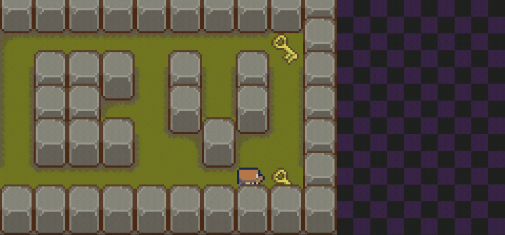
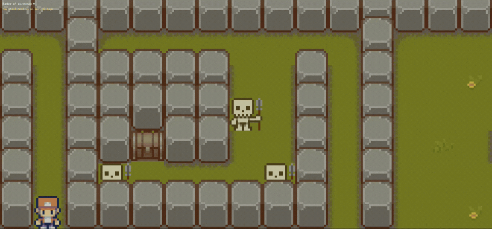

# 42_so_long
# `125/100`

## Hola🤗 bienvenid@ a 42_so_long, mi sexto proyecto de 42

🎮 42_so_long es mi sexto proyecto de 42

Este proyecto consiste en desarrollar un pequeño juego en 2D utilizando la biblioteca gráfica MiniLibX. 🌟 El objetivo del juego es guiar a un personaje a través de un laberinto 🌀, recolectando llaves 🔑 y evitando enemigos 💀 hasta llegar al cofre del tesoro 💰.

El programa es capaz de cargar cualquier mapa con extensión .ber que cumpla con las siguientes condiciones:
- Ser rectangular.
- Estar completamente cerrado (sin huecos en los bordes).
- Ser resoluble, es decir, debe existir un camino desde el jugador hasta el cofre y las llaves.
- Contener solo los siguientes caracteres:
```
 1 para los muros.			1111111111111111
 0 para los caminos.		1P0E1C0000000001
 P para el jugador.			1000100000100001
 E para el cofre.			10000000001000C1
 C para las llaves.			1111111111111111
```
```sh
./so_long maps/hormimap.ber
```


## Bonus:
Para el bonus del proyecto, he agregado las siguientes mejoras:
- Posibilidad de añadir enemigos en el mapa colocando el carácter X.
- El contador de pasos y llaves aparece en la ventana del juego en lugar del terminal.
- Animaciones a los esqueletos 💀 y a las plantas del terreno 🌿.

```sh
./so_long maps/hormimap.ber
```


Me habría gustado añadir animación de desplazamiento y caminar al jugador, así como una transición al cambiar de fragmento del mapa.

Ha sido un proyecto muy entretenido, me apasiona el desarrollo de videojuegos. Me encantaría tener más tiempo para mejorarlo, pero tengo que pasar página y centrarme en los próximos proyectos.

Espero que te juste el proyecto y si te atreves a jugarlo ¡Mi récord está en `581` para el mapa `bigmap_bonus.ber` ¿Puedes superarlo?😊

```sh

```

## Personalización del Tamaño de la Ventana:
dependencia
En caso de querer que la ventana, y por tanto los fragmentos de mapa, sean más o menos grandes que el tamaño por defecto, puedes compilar con las reglas `make build_windows_max_size` o `make build_bonus_windows_max_size` y modificar el alto y el ancho máximo de la ventana.

## Dependencia
```
sudo apt-get install libxext-dev
sudo apt-get install libx11-dev
```